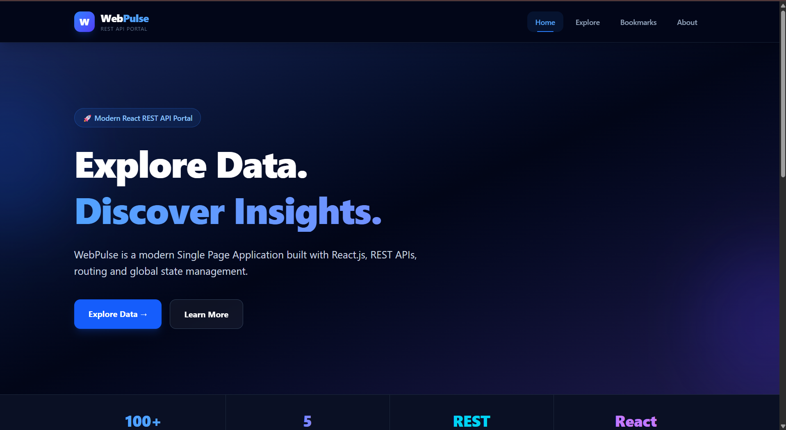
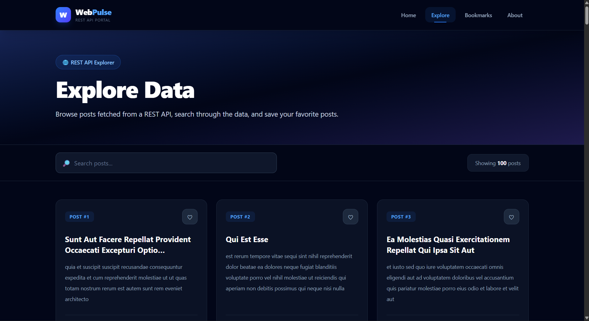
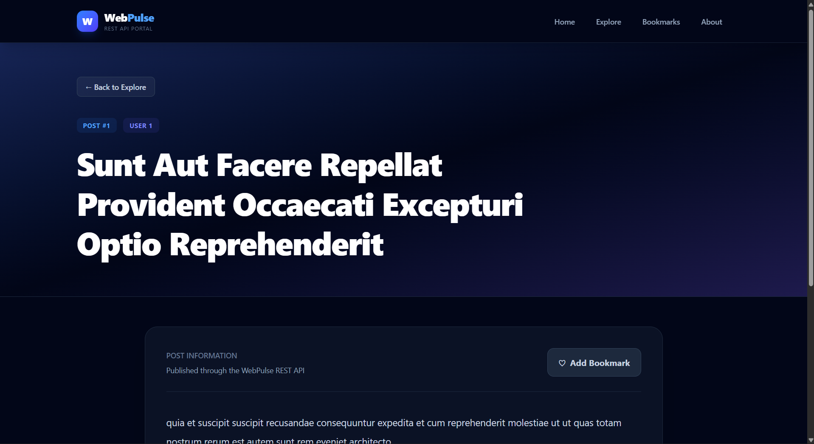
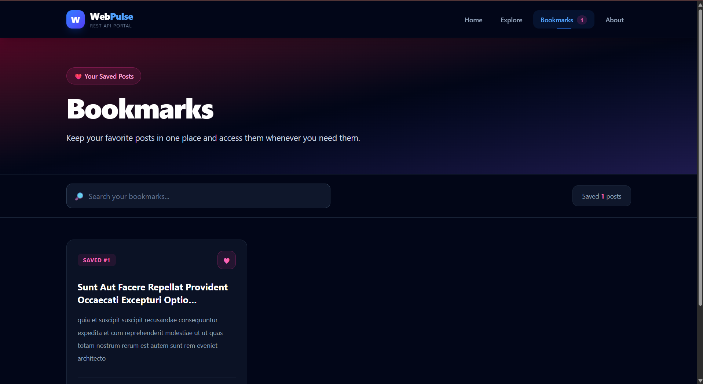
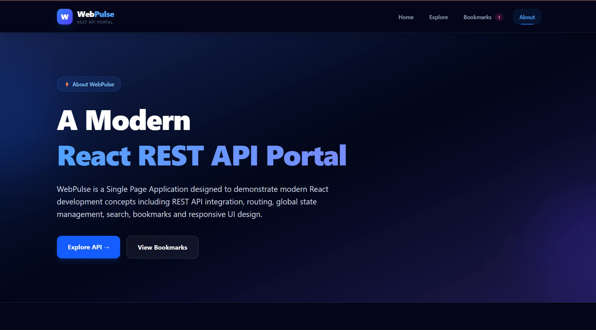

# 🚀 WebPulse

<div align="center">

## A Modern React REST API Portal

A polished Single Page Application built with **React.js, Vite, Tailwind CSS, Axios, React Router, and Context API**.

<br>

<a href="https://webpulse-app.vercel.app/">
  
</a>

<a href="https://github.com/saimanikantagunda626/WebPulse">
  
</a>

</div>

---

## 🌐 Live Demo

### 🔗 https://webpulse-app.vercel.app/

WebPulse is a modern REST API portal that demonstrates how a React application can fetch, search, display, and manage API data through a clean and responsive user interface.

---

## 📸 Project Preview

### 🏠 Home Page



### 🔎 Explore Page



### 📄 Details Page



### ❤️ Bookmarks Page



### ℹ️ About Page



---

## ✨ Features

| Feature | Description |
|---|---|
| 🌐 REST API Integration | Fetches post data from a REST API using Axios |
| 🔎 Search | Search posts by title and content |
| 📄 Post Details | View complete information for individual posts |
| ❤️ Bookmarks | Save favorite posts for quick access |
| 💾 LocalStorage | Bookmarks remain available after page refresh |
| 🌍 Global State | Bookmark state is managed using React Context API |
| 🧭 Client-side Routing | Navigate between pages without full page reloads |
| ⚡ Lazy Loading | Pages are loaded dynamically using React lazy loading |
| 📱 Responsive UI | Designed for desktop, tablet, and mobile screens |
| 🚨 Error Handling | Handles loading, empty, and API error states |
| 🔗 SPA Routing | Vercel rewrite configuration supports direct routes |
| ❌ 404 Page | Custom page for invalid routes |

---

## 🛠️ Tech Stack

### Frontend


### Libraries & Tools


---

## 🧩 Application Pages

### 🏠 Home

The landing page introduces WebPulse and provides quick navigation to the main features.

### 🔎 Explore

The Explore page fetches posts from the REST API and provides:

- API data display
- Search functionality
- Bookmark actions
- Post cards
- User information
- Navigation to detailed views

### 📄 Details

The Details page displays complete information about a selected post.

Users can also bookmark or remove the post from bookmarks.

### ❤️ Bookmarks

The Bookmarks page displays all saved posts.

Features include:

- Saved post count
- Bookmark search
- Remove bookmark
- Navigate to post details
- Persistent LocalStorage data

### ℹ️ About

The About page provides information about the project, technologies, and React concepts used.

### ❌ 404

A custom 404 page is displayed when users visit an invalid route.

---

## 🔌 REST API

WebPulse uses **JSONPlaceholder** as the external REST API.

### API Endpoint

```text
https://jsonplaceholder.typicode.com/posts